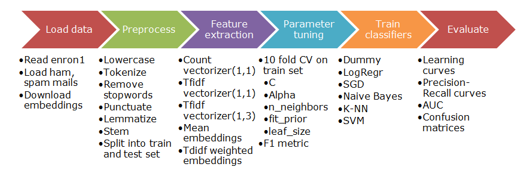

# Text classification with (mostly) linear classifiers
The task of this work is to train and evaluate various classifiers to distinguish spam from non-spam (ham) emails using the <a href="http://nlp.cs.aueb.gr/software_and_datasets/Enron-Spam/preprocessed/enron1.tar.gz">Enron</a> dataset. The approach is a supervised one due to the fact we already know the category (spam/ham) where an email belongs.

Emails are modeled using two types of text representation. The first one is a **Bag-of-Words** model weighted by TC (term count) or TF-IDF (term frequency - inverse document frequency). The second, **Centroids-of-Word-Embeddings** represents an email by averaging the word embeddings of all words or by summing weighted word embeddings of all words, where the weight of a word is given by TF-IDF.

We choose to experiment with five algorithms: **Logistic Regression (LR)**, **SGD**, **Naïve Bayes (NB)**, **Nearest Neighbors (KNN)** and **SVM**. Also a baseline **Dummy** classifier predicting always the majority class (ham) is used for comparison.

So in this work we make 25 experiments in total (5 methods x 5 classifiers). A summarization of our system and inner-code working is shown in following figure:

Each model’s performance is finally evaluated on a separate “test” set for which we know the categories, but let the model predict these. Comparison between the predicted and true category (spam or ham) indicates model performance. For this we use tools like learning curves, precision-recall curves and confusion matrices.

## Experimental Results - Conclusions

The results of our 25 experiments are summarized in Table 1 where the best classifier for every method according to **AUC** score and its performance is presented. We observe that in general F1 and Accuracy scores follow AUC scores except in TFIDF weighted embeddings method where KNN even it has the lowest AUC score it has the second best F1 and Accuracy scores (between all our evaluated classifiers). LR and SVM seem to be the best overall estimators.

The Bag-of-Words representation method **TC (1,1)** seems to have very good results even with simple term count features. The best performance is achieved when we use tfidf features like in **TFIDF (1,3)** method. The gain in AUC, compared to much smaller and computationally cheaper feature set of **Centroids-of-Word-Embeddings**, is ~1.6%.

As for the Centroids-of-Word-Embeddings representation we observe that TFIDF weighting doesn’t offer much advance over the simpler mean averaging of word embeddings. Using custom word-vectors generated from the corpus at hand (Enron dataset) are likely to yield better quality classification results.

A very interesting point is that KNN even it has the lowest AUC scores it seems the best choice when we are interested only in low number of False Positives, ignoring the number of False Negatives (it hurts more when we predict a ham email as spam).
